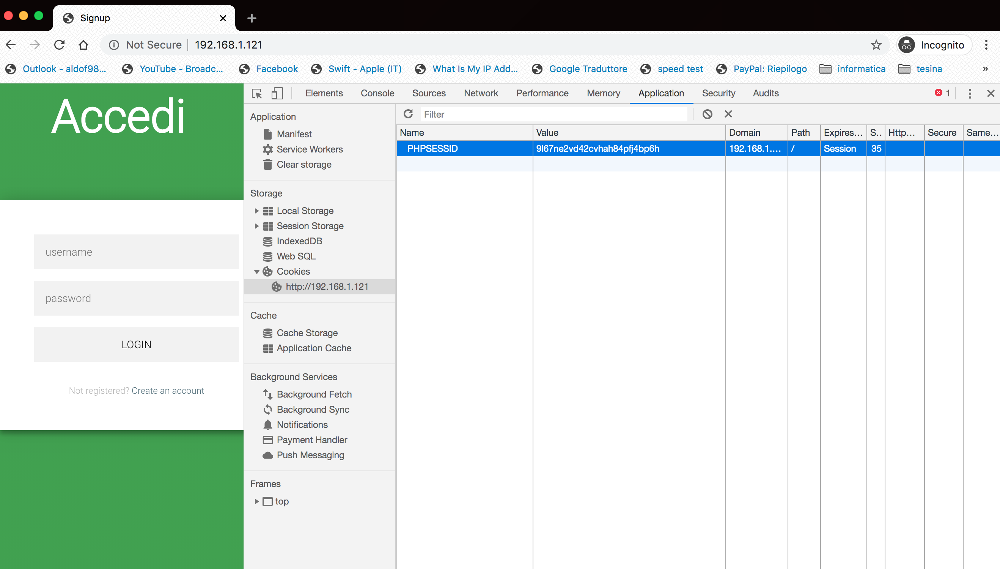

# Progetto Reti di calcolatori — Packet Sniffer
_**di Aldo Fumagalli e Francesco Torregrossa, A.A. 19/20**_

Abbiamo realizzato un programma in C che ascolta e analizza tutti i pacchetti ricevuti dal computer, permettendo di mostrare dettagli come la sorgente, il destinatario, i protocolli utilizzati, e anche i contenuti che essi trasportano.

Successivamente, abbiamo caricato il programma su un dispositivo [OrangePi](http://www.orangepi.org) munito di una scheda di rete wireless TP-Link [TL-WN722N](https://www.tp-link.com/it/home-networking/adapter/tl-wn722n/).</br>
Abbiamo anche preparato un sito web fittizio in PHP, HTML e CSS (Client/Server) che simula una piattaforma di audio streaming con le funzionalità di accesso, registrazione e uso generale.

Così, accedendo e utilizzando il sito web tramite client, abbiamo potuto simulare l'invio di alcuni pacchetti che sono poi stati analizzati dal nostro programma, attivo sull'OrangePi. Questo ci ha permesso di accedere ai dati sensibili e di verificare la correttezza delle informazioni ottenute dal programma stesso.

<!-- TOC depthfrom:2 depthto:4 -->

- [Sviluppo del programma](#sviluppo-del-programma)
  - [Protocolli e strutture dati](#protocolli-e-strutture-dati)
    - [Ethernet](#ethernet)
    - [IPv4](#ipv4)
    - [ICMP](#icmp)
    - [TCP](#tcp)
    - [UDP](#udp)
  - [Ricezione dei pacchetti](#ricezione-dei-pacchetti)
  - [Analisi dei pacchetti](#analisi-dei-pacchetti)
- [Preparazione dell'OrangePi](#preparazione-dellorangepi)
  - [Verifica dei driver della scheda di rete](#verifica-dei-driver-della-scheda-di-rete)
  - [Trovare il nome della scheda di rete](#trovare-il-nome-della-scheda-di-rete)
    - [Verifica avvenuta creazione interfaccia wireless](#verifica-avvenuta-creazione-interfaccia-wireless)
  - [Attivazione dell'interfaccia](#attivazione-dellinterfaccia)
    - [Creazione file di configurazione](#creazione-file-di-configurazione)
    - [Avvio wpasupplicant](#avvio-wpasupplicant)
    - [Avvio del prompt interattivo del tool wpa](#avvio-del-prompt-interattivo-del-tool-wpa)
  - [Richiesta indirizzo IP](#richiesta-indirizzo-ip)
  - [Risoluzione dei problemi](#risoluzione-dei-problemi)
  - [Configurazione del server](#configurazione-del-server)
    - [Installazione e configurazione dei software necessari](#installazione-e-configurazione-dei-software-necessari)
- [Sviluppo del sito web](#sviluppo-del-sito-web)
  - [Database](#database)
    - [Tabella utenti](#tabella-utenti)
    - [Tabella autori](#tabella-autori)
    - [Tabella brani](#tabella-brani)
  - [Login, Sessione, gestione database e logout](#login-sessione-gestione-database-e-logout)
  - [Registrazione e pagina utente](#registrazione-e-pagina-utente)
  - [Home, ricerca e scheda brano](#home-ricerca-e-scheda-brano)
  - [Aggiunzione dei brani](#aggiunzione-dei-brani)
- [Prova dello sniffer](#prova-dello-sniffer)

<!-- /TOC -->

## Sviluppo del programma

### Protocolli e strutture dati

Ogni pacchetto di rete è stratificato, e ogni strato segue i suoi protocolli, ciascuno con delle proprietà e dei dati diversi. Perciò, partendo dai byte grezzi, abbiamo predisposto delle `struct` adatte a contenere gli header di ciascun protocollo e delle funzioni per analizzarli e visualizzarli. Il tutto è stato raccolto all'interno di vari file `.h` e `.c`, una coppia per protocollo.

Per prima cosa, però, riportiamo i seguenti alias, che abbiamo definito nel file [`datatypes.h`](./protocols/datatypes.h) per fare chiarezza sui dati
```c
typedef unsigned char byte;
typedef unsigned short word;
typedef unsigned int dword;
typedef byte *packet;
typedef char *string;
```

Abbiamo anche predisposto le seguenti funzioni per facilitare il passaggio tra codifiche `LITTLE_ENDIAN` e `BIG_ENDIAN`

```c
word switch_encoding_w(word w);
dword switch_encoding_dw(dword dw);
```

In questa relazione analizzeremo soltanto i protocolli Ethernet e IP perché le considerazioni fatte su di essi possono essere facilmente riportate per tutti gli altri protocolli presi in esame.

#### Ethernet

Il protocollo Ethernet prevede un header di lunghezza fissa di 14 byte, di cui 6 sono dedicati all'indirizzo MAC del destinatario e 6 a quello della sorgente, e gli ultimi 2 indicano il protocollo utilizzato.

```
 0 1 2 3 4 5 6 7 | 0 1 2 3 4 5 6 7 | 0 1 2 3 4 5 6 7 | 0 1 2 3 4 5 6 7
+-+-+-+-+-+-+-+- + -+-+-+-+-+-+-+- + -+-+-+-+-+-+-+- + -+-+-+-+-+-+-+-+
|                   destination MAC (first 4 bytes)                   |
+-+-+-+-+-+-+-+- + -+-+-+-+-+-+-+- + -+-+-+-+-+-+-+- + -+-+-+-+-+-+-+-+
|  destination MAC (last 2 bytes)  |    source MAC (first 2 bytes)    |
+-+-+-+-+-+-+-+- + -+-+-+-+-+-+-+- + -+-+-+-+-+-+-+- + -+-+-+-+-+-+-+-+
|                       source MAC (last 2 bytes)                     |
+-+-+-+-+-+-+-+- + -+-+-+-+-+-+-+- + -+-+-+-+-+-+-+- + -+-+-+-+-+-+-+-+
|            type code             |
+-+-+-+-+-+-+-+- + -+-+-+-+-+-+-+- +
```

Abbiamo predisposto una struttura con 6 byte, nominati da `a` ad `f`, per rappresentare un singolo indirizzo MAC. Questa struttura è stata utilizzata nella realizzazione di quella principale, `eth_header`.

```c
#define ETH_HEADER_SIZE 14

typedef struct
{
  byte a;
  byte b;
  byte c;
  byte d;
  byte e;
  byte f;
} mac_address;

struct eth_header
{
  mac_address destination_host;
  mac_address source_host;
  word type_code;

  packet next;  // puntatore al pacchetto incapsulato
};

typedef struct eth_header *eth_header;
```

La struttura contiene anche un puntatore `packet next` che serve per raggiungere facilmente il pacchetto incapsulato. Abbiamo definito la seguente funzione per assegnare il valore corretto al puntatore.

```c
eth_header prepare_eth_header(packet data);
{
  eth_header header = malloc(sizeof(struct eth_header));
  memcpy(header, data, ETH_HEADER_SIZE);
  header->next = data + ETH_HEADER_SIZE;
  return header;
}
```

#### IPv4

```
 0 1 2 3 4 5 6 7 | 0 1 2 3 4 5 6 7 | 0 1 2 3 4 5 6 7 | 0 1 2 3 4 5 6 7
+-+-+-+-+-+-+-+- + -+-+-+-+-+-+-+- + -+-+-+-+-+-+-+- + -+-+-+-+-+-+-+-+
|  ihl  |  vers  | type of service |            total length          |
+-+-+-+-+-+-+-+- + -+-+-+-+-+-+-+- + -+-+-+-+-+-+-+- + -+-+-+-+-+-+-+-+
|          identification          | 0|d|m|     fragment offset       |
+-+-+-+-+-+-+-+- + -+-+-+-+-+-+-+- + -+-+-+-+-+-+-+- + -+-+-+-+-+-+-+-+
|  time to live  |    protocol     |              checksum            |
+-+-+-+-+-+-+-+- + -+-+-+-+-+-+-+- + -+-+-+-+-+-+-+- + -+-+-+-+-+-+-+-+
|                          source IP address                          |
+-+-+-+-+-+-+-+- + -+-+-+-+-+-+-+- + -+-+-+-+-+-+-+- + -+-+-+-+-+-+-+-+
|                       destination IP address                        |
+-+-+-+-+-+-+-+- + -+-+-+-+-+-+-+- + -+-+-+-+-+-+-+- + -+-+-+-+-+-+-+-+
|                      options (variable length)                      |
+-+-+-+-+-+-+-+- + -+-+-+-+-+-+-+- + -+-+-+-+-+-+-+- + -+-+-+-+-+-+-+-+
```

Anche per i pacchetti IPv4 abbiamo seguito la stessa logica, ovvero dopo aver analizzato l'header del pacchetto abbiamo creato una struttura adeguata ad ospitare i dati previsti. In particolare, è stato molto utile rappresentare alcuni dati utilizzando i bit field.

```c
#define IP_HEADER_SIZE 20

typedef struct
{
  byte a;
  byte b;
  byte c;
  byte d;
} ip_address;

struct ip_header
{
  byte
      header_length : 4,
      version : 4;
  byte type_of_service;
  word total_length;

  word id;
  word : 1,
      flag_do_not_fragment : 1,
      flag_more_fragments : 1,
      fragment_offset : 13;

  byte time_to_live;
  byte protocol;
  word checksum;

  ip_address source_address;
  ip_address destination_address;

  void *options;

  packet next;
};

typedef struct ip_header *ip_header;
```

Come in precedenza, abbiamo definito la funzione `prepare_ip_header` per stabilire il valore del puntatore al pacchetto incapsulato `next`.

Tuttavia, questo header non ha lunghezza fissa, perché potrebbe contenere delle `options`. Per sapere se le contiene possiamo leggere il parametro `header_length`, che ha un valore minimo di 5 (`options` non presente) e un valore massimo di 15, e va interpretato come numero di *gruppi di 4 byte*. Se vale 5, la lunghezza dell'header IP è di 5 gruppi di 4 byte, cioè 20 byte.

Inoltre, in questo header sono presenti dei dati di tipo `word` che devono essere convertiti prima dell'utilizzo.

```c
ip_header prepare_ip_header(packet data)
{
  ip_header header = malloc(sizeof(struct ip_header));
  memcpy(header, data, IP_HEADER_SIZE);

  unsigned int options_length = size_ip_header(header) - IP_HEADER_SIZE;
  if (options_length)
  {
    header->options = malloc(options_length);
    memcpy(header->options, data + IP_HEADER_SIZE, options_length);
  }
  else
    header->options = NULL;

  header->next = data + IP_HEADER_SIZE + options_length;

  header->total_length = switch_encoding_w(header->total_length);
  header->id = switch_encoding_w(header->id);
  header->checksum = switch_encoding_w(header->checksum);

  return header;
}

dword size_ip_header(ip_header header) {
  return header->header_length * 4;
}
```

#### ICMP

```
 0 1 2 3 4 5 6 7 | 0 1 2 3 4 5 6 7 | 0 1 2 3 4 5 6 7 | 0 1 2 3 4 5 6 7
+-+-+-+-+-+-+-+- + -+-+-+-+-+-+-+- + -+-+-+-+-+-+-+- + -+-+-+-+-+-+-+-+
|      type      |       code      |             checksum             |
+-+-+-+-+-+-+-+- + -+-+-+-+-+-+-+- + -+-+-+-+-+-+-+- + -+-+-+-+-+-+-+-+
|                               options                               |
+-+-+-+-+-+-+-+- + -+-+-+-+-+-+-+- + -+-+-+-+-+-+-+- + -+-+-+-+-+-+-+-+
```

#### TCP

```
 0 1 2 3 4 5 6 7 | 0 1 2 3 4 5 6 7 | 0 1 2 3 4 5 6 7 | 0 1 2 3 4 5 6 7
+-+-+-+-+-+-+-+- + -+-+-+-+-+-+-+- + -+-+-+-+-+-+-+- + -+-+-+-+-+-+-+-+
|           source port            |          destination port        |
+-+-+-+-+-+-+-+- + -+-+-+-+-+-+-+- + -+-+-+-+-+-+-+- + -+-+-+-+-+-+-+-+
|                           sequence number                           |
+-+-+-+-+-+-+-+- + -+-+-+-+-+-+-+- + -+-+-+-+-+-+-+- + -+-+-+-+-+-+-+-+
|                       acknowledgment number                         |
+-+-+-+-+-+-+-+- + -+-+-+-+-+-+-+- + -+-+-+-+-+-+-+- + -+-+-+-+-+-+-+-+
| data  |        | c|e|u|a|p|r|s|f |                                  |
|offset |0 0 0 0 | w|c|r|c|s|s|y|i |              window              |
|       |        | r|e|g|k|h|t|n|n |                                  |
+-+-+-+-+-+-+-+- + -+-+-+-+-+-+-+- + -+-+-+-+-+-+-+- + -+-+-+-+-+-+-+-+
|            checksum              |           urgent pointer         |
+-+-+-+-+-+-+-+- + -+-+-+-+-+-+-+- + -+-+-+-+-+-+-+- + -+-+-+-+-+-+-+-+
|                    options            ... | ...       padding       |
+-+-+-+-+-+-+-+- + -+-+-+-+-+-+-+- + -+-+-+-+-+-+-+- + -+-+-+-+-+-+-+-+
```

#### UDP

```
 0 1 2 3 4 5 6 7 | 0 1 2 3 4 5 6 7 | 0 1 2 3 4 5 6 7 | 0 1 2 3 4 5 6 7
+-+-+-+-+-+-+-+- + -+-+-+-+-+-+-+- + -+-+-+-+-+-+-+- + -+-+-+-+-+-+-+-+
|           source port            |          destination port        |
+-+-+-+-+-+-+-+- + -+-+-+-+-+-+-+- + -+-+-+-+-+-+-+- + -+-+-+-+-+-+-+-+
|              length              |              checksum            |
+-+-+-+-+-+-+-+- + -+-+-+-+-+-+-+- + -+-+-+-+-+-+-+- + -+-+-+-+-+-+-+-+
```

### Ricezione dei pacchetti

Mediante le librerie `sys/socket.h` e `netinet/if_ether.h`, abbiamo richiesto al sistema la creazione di una socket in grado di ricevere qualsiasi pacchetto, la cui lettura viene realizzata tramite il metodo `read` della libreria `unistd.h`.

Nel dettaglio, la socket viene creata con questi parametri

```c
int socket(int family, int type, int protocol)
```

- `family` viene impostato a `AF_PACKET`, così la comunicazione può avvenire al livello di collegamento, quindi si riceveranno i frame Ethernet
- `type` viene impostato a `SOCK_RAW`, per accettare pacchetti con qualsiasi tipo di socket
- `protocol` viene impostato a `ETH_P_ALL`, per indicare che pacchetti con qualsiasi protocollo della `family` sono accettati (anche se successivamente analizzeremo solo quelli contenenti IPv4)

Pertanto, il codice che esegue la lettura è il seguente, in cui la funzione `ntohs` esegue il passaggio da `LITTLE_ENDIAN` a `BIG_ENDIAN` e viceversa (se necessario)

```c
int sock = socket(AF_PACKET, SOCK_RAW, ntohs(ETH_P_ALL));
if (sock < 0)
    perror("Socket creation error");

while (read(sock, buffer, PKT_LEN) > 0)
    analyze(buffer);
```

### Analisi dei pacchetti

Ogni volta che arriva un pacchetto qualsiasi, esso viene analizzato e scomposto utilizzando le funzioni e le strutture relative ai vari protocolli.

Di seguito riportiamo lo scheletro della funzione `analyze`, che mostra la logica con cui i pacchetti vengono estratti a vari livelli. La funzione vera, nel file `sniffer.c`, gestisce, tra le altre cose, anche i filtri sull'output a video.

```c
void analyze(packet buffer)
{
  eth_header eh = prepare_eth_header(buffer);
  describe_eth_header(eh);

  if (eh->type_code == ntohs(ETH_P_IP))
  {
    ip_header iph = prepare_ip_header(eh->next);
    describe_ip_header(iph);

    switch (iph->protocol)
    {
    case IPPROTO_ICMP:
    {
      icmp_header icmph = prepare_icmp_header(iph->next);
      describe_icmp_header(icmph);
      print_plaintext(icmph->next, iph->total_length - size_ip_header(iph) - size_icmp_header(icmph));
      break;
    }
    case IPPROTO_TCP:
    {
      tcp_header tcph = prepare_tcp_header(iph->next);
      describe_tcp_header(tcph);
      print_plaintext(tcph->next, iph->total_length - size_ip_header(iph) - size_tcp_header(tcph));
      break;
    }
    case IPPROTO_UDP:
    {
      udp_header udph = prepare_udp_header(iph->next);
      describe_udp_header(udph);
      print_plaintext(udph->next, iph->total_length - size_ip_header(iph) - size_udp_header(udph));
      break;
    }
    default:
      print_plaintext(iph->next, iph->total_length - size_ip_header(iph));
      break;
    }
  }
}
```

## Preparazione dell'OrangePi
l'OrangePi è una scheda **Open-Source** basata su architettura **ARM**, su questa scheda possono essere eseguite distribuzioni linux e quella che abbiamo utilizzzato noi è  **Armbian**, una distribuzione di linux creata per dispositivi che funzionano con architetture **ARM**.

Ciò che segue è la configurazione della scheda di rete wireless e quindi delle impostazioni di rete dell'OrangePi. Essa è suddivisa in più fasi procedurali, dove la non riuscita di una qualsiasi di esse causa il non poter procedere alla fase successiva, e quindi in queste situazioni bisogna intevenire con strumenti di risuluzione per poter, poi, riprendere con la normale procedura.

### Verifica dei driver della scheda di rete
Prima di tutto bisogna verificare che i driver installati nel nostro dispositivo siano compatibili con la nostra scheda di rete. Questo si può fare con il seguente comando:
```bash
$ lspci -k
06:00.0 Network controller: Intel Corporation WiFi Link 5100
	Subsystem: Intel Corporation WiFi Link 5100 AGN
	Kernel driver in use: iwlwifi
	Kernel modules: iwlwifi
```
In questo caso i driver sono correttamenti installati, ma in caso contrario bisognerebbe ricorrere a comandi risolutivi per l'installazione dei driver corretti, se esistenti.

### Trovare il nome della scheda di rete
Dopo la verifica dei driver bisogna immediatamente identificare la nostra scheda di rete, e successivamente controllare che l'interfaccia wireless si sia creata correttamente autonomamente, in maniera tale da poter incominciare la nostra vera e propria configurazione.
```bash
$ iwconfig
wlan0  unassociated  Nickname:"<WIFI@REALTEK>"
          Mode:Auto  Frequency=2.412 GHz  Access Point: Not-Associated   
          Sensitivity:0/0  
          Retry:off   RTS thr:off   Fragment thr:off
          Power Management:off
          Link Quality:0  Signal level:0  Noise level:0
          Rx invalid nwid:0  Rx invalid crypt:0  Rx invalid frag:0
          Tx excessive retries:0  Invalid misc:0   Missed beacon:0
```
*wlan0* è il nome della nostra scheda di rete

#### Verifica avvenuta creazione interfaccia wireless

```bash
$ ip link set dev wlan0 up
```
Non restituendo nessun errore, il terminale conferma l'avvenuta creazione.

### Attivazione dell'interfaccia

Il primo passo è quello di abilitare l'interfaccia tramite il comando *iw* o alternativamente *ifconfig*. Questi due sono riepsettivamente comandi per la gestione delle interfaccie wireless (*iw*) e per le interfacce in generale (*ifconfig*).
```bash
$ iw wlan0 up
```

#### Creazione file di configurazione

Il secondo passo è quello di creare un file di configurazione, dove i nostri tool che ci permetteranno di configurare la rete andranno a salvare informazioni che servono ad accedere alla rete e a mantenere la connessione con essa.

```bash
/etc/wpa_supplicant.conf
ctrl_interface=/run/wpa_supplicant
update_config=1
```

#### Avvio wpa_supplicant

*wpa_supplicant* è un tool che ci permette di stabilire una connessione wireless con chiave **WPA**. Quindi esso deve essere avviato specificando il file di configurazione dove lui si dovrà appoggiare.

```bash
$ wpa_supplicant -B -i interface -c /etc/wpa_supplicant.conf
```

#### Avvio del prompt interattivo del tool wpa

*wpa_cli* è un prompt interattivo che funziona tramite *wpa_supplicant*. Da esso avverrà la configurazione della connessione tra la nostra scheda di rete Wi-Fi e il router della rete Wi-Fi su cui vogliamo collegarci. Per semplicità l'SSID della rete wireless sarà *MIOSSID*.

```bash
$ wpa_cli
```
Scansione delle reti con il comando *scan* e successiva stampa del risultato tramite *scan_result*
```bash
> scan									#scansione reti
OK
<3>CTRL-EVENT-SCAN-RESULTS
> scan_results					#stampa
bssid / frequency / signal level / flags / ssid
00:00:00:00:00:00 2462 -49 [WPA2-PSK-CCMP][ESS] MIOSSID
11:11:11:11:11:11 2437 -64 [WPA2-PSK-CCMP][ESS] ALTROSSID
```
Aggiunta della rete con inserimento delle credenziali tramite: *add_network*, *set_network* e *enable_network*. Per semplicità la password della rete wireless sarà: *passphrase*
```bash
> add_network						#aggiunta rete
0
> set_network 0 ssid "MIOSSID"
> set_network 0 psk "passphrase"
> enable_network 0
<2>CTRL-EVENT-CONNECTED - Connection to 00:00:00:00:00:00 completed (reauth) [id=0 id_str=]
```
Questo combinazione di comandi non fa altro che creare una configurazione di rete nel file ```/etc/wpa_supplicant.conf``` come segue:
```
network={
    ssid="MIOSSID"
    #psk="passphrase"
    psk=59e0d07fa4c7741797a4e394f38a5c321e3bed51d54ad5fcbd3f84bc7415d73d
}
```
Se la connessione è avvenuta con successo, allora bisogna salvare la configurazione con il comando *save_config*:
```bash
>save_config
OK
```

### Richiesta indirizzo IP

Ultimo passaggio è quello della richiesta dell'indirizzo IP tramite il comando *dhcpcd* per finalemente partecipare alla rete, se non presente il comando deve essere installato, poichè necessario per la comunicazione con il server dhcpd del router.

```bash
$ dhcpcd wlan0
```

### Risoluzione dei problemi

Se per qualche motivo dopo la configurazione di *wpa_supplicant* la connessione dovesse fallire allora necessitano dei comandi per la gestione delle sessioni di *wpa_supplicant*:

+ Il comando ```ps ax | grep "wpa_supplicant -B" |grep -v grep``` permette di visualizzare l'id di tutte le sessioni che sono state aperte con *wpa_supplicant*, in maniera tale da poterle gestire, visto che per esistere una connessione con questo tool, deve essere attiva un'unica sessione di *wpa_supplicant*
+ il comando ```kill $(pgrep -f "wpa_supplicant -B")``` chiuderà tutte i processi di *wpa_supplicant*, così da darmi la possibilità di riconfigurare la rete in maniera diversa per far avvenire una effettiva connessione


### Configurazione del server

Il sito web che abbiamo creato è una piattaforma mock di condivisione di tracce audio generate dagli utenti. Prevede che gli utenti si registrino prima di poter effettuare delle ricerche o dei nuovi caricamenti.
Il server sarà eseguito sull'OrangePi e la comunicazione avverrà sul protocollo HTTP.

#### Installazione e configurazione dei software necessari

Il server farà uso di Apache, MySQL, PHP5 e phpmyadmin.
```bash
sudo apt-get install mysql-server
sudo apt-get install apache2
sudo apt-get install php libapache2-mod-php
sudo apt-get install phpmyadmin
```

Accedendo dal browser all'indirizzo `MIOIP/phpmyadmin` è possibile eseguire la configurazione iniziale automatica, alla quale sarà richiesta la scelta di una password per l'utente `phpmyadmin`.

Successivamente, sarà necessario creare un database per il nostro servizio, per il quale l'utente `phpmyadmin` avrà tutti i permessi.

```bash
sudo mysql -u root
```

```sql
CREATE DATABASE catalogomusica;
GRANT ALL PRIVILEGES ON catalogomusica.* TO 'phpmyadmin'@'localhost';
```

## Sviluppo del sito web

### Database

Le tabelle del database sono state create tramite phpmyadmin. Di seguito riportiamo la tabella degli utenti, quella degli autori e quella dei loro brani.
```
+--------------------------+
| catalogomusica           |
+--------------------------+
| autori                   |
| brani                    |
| utenti                   |
+--------------------------+
```

#### Tabella utenti

```
+----+----------+----------+--------------------+--------+-------------+-------+--------+
| id | username | password | email              | Nome   | Cognome     | admin | avatar |
+----+----------+----------+--------------------+--------+-------------+-------+--------+
|  1 | ikros    | linux    | aldof98@hotmail.it | Aldo   | Fumagalli   |     1 | NULL   |
| 12 | frank    | linux    | frango@pr.it       | Frango | Torregrossa |     0 | NULL   |
+----+----------+----------+--------------------+--------+-------------+-------+--------+
```

#### Tabella autori

```
+----+------------+-------------------+------+
| id | Nome       | Genere            | Eta  |
+----+------------+-------------------+------+
|  1 | Pink Floyd | Rock Psichedelico | NULL |
+----+------------+-------------------+------+
```

#### Tabella brani

```
+----+--------------------+--------------------+------+--------+-----------------+--------------------------+
| id | Titolo             | Album              | Anno | autore | file            | immagine                 |
+----+--------------------+--------------------+------+--------+-----------------+--------------------------+
|  1 | wish you were here | wish you were here | 1975 |      1 | brani/horse.mp3 | copertina/Pink_Floyd.png |
+----+--------------------+--------------------+------+--------+-----------------+--------------------------+
```

### Login, Sessione, gestione database e logout

Quando un client per la prima volta fa una richiesta al server effettuerà una connessione al database tramite uno script php.

La sessione viene creata non appena un utente compila correttamente il form di login tramite l'email e la  password del suo profilo. Essa serve per identificare l'utente all'interno delle varie pagine del sito web.

Il logout viene effettuato da uno script php che cancella la sessione, non permettendo all'untente di entrare nelle pagine interne della pagina.

### Registrazione e pagina utente

Il form all'interno della pagina di registrazione permette di effettuare una registrazioine all'interno del sito, creando un profilo utente. Successivamente l'untente sarà reindirizzato alla Home page.

Nella pagina utente è presente un riepilogo delle informazioni sensibili che compongono l'account compresa l'immagine del profilo. All'interno di questa pagina è presente un pulsante "Modifica" che permette di modificare le informazioni del profilo dell'utente, compresa la password. La pagina di modifica è stata realizzata tramite un form pre-compilato dalle informazioni dell'utente, che esso stesso può modificare e poi infine farne il submit.

|          Login           |          Pagina Utente          |
| :----------------------: | :-----------------------------: |
|  |  |

### Home, ricerca e scheda brano

Nella Home page, come in ogni pagina all'interno del sito è presente una navigation-bar che permette all'utente di navigare all'interno del sito.

La pagina di ricerca è composta da un form dove è possibile inserire diverse informazioni riguardo al brano o all'autore da ricercare. Dopo aver effettuato il submit lo script comporrà una query per il database e successivamente ne saranno mostrati i risultati componendo codice HTML e CSS. I risultati sono collegati alle proprie pagine di "scheda brano" dove è appunto possibile ascoltarli tramite HTML5. Di seguito le parti principali del codice della pagina di ricerca:
```php
<html>
<head>
<!-- ... -->
<!-- ... -->

  <!-- Search form -->
    <div class="w3-content w3-justify w3-text-grey w3-padding-64">
      <h2 class="w3-text-light-grey">Cerca brano</h2>
      <hr style="width:200px" class="w3-opacity">
      
      <br>
  
      <form action="<?php $_SERVER['PHP_SELF'] ?>" method="post" autocomplete="off">
        <p><input class="w3-input w3-padding-16" type="text" placeholder="Titolo" name="titolo"></p>
        <p><input class="w3-input w3-padding-16" type="text" placeholder="Autore" name="autore"></p>
        <p><input class="w3-input w3-padding-16" type="text" placeholder="Album" name="album"></p>
        <p><input class="w3-input w3-padding-16" type="text" placeholder="Anno" name="anno" maxlength="4"></p>
        <p>
          <button class="w3-button w3-light-grey w3-padding-large" type="submit" name="cerca">
            <i class="fa fa-search"></i> CERCA
          </button>
          <button class="w3-button w3-light-grey w3-padding-large" type="reset">
            <i class="fa fa-trash-o" aria-hidden="true"></i> CANCELLA
          </button>
        </p>
      </form>
    </div>

<!-- Script PHP che comporrà la query in base alle informazioni del form -->
<?php
//qua viene generata la mia query
if(isset($_POST["cerca"]))
  {
    require "database.php";
    $sql= "SELECT B.id, B.titolo, A.Nome AS autore, B.album, B.anno, A.id AS id_aut FROM brani AS B, autori AS A WHERE B.id=A.id AND ";
    $cont=0;
    $titolo=strtolower($_POST["titolo"]);
    $autore=strtolower($_POST["autore"]);
    $album=strtolower($_POST["album"]);
    $anno=$_POST["anno"];
    if(!empty($titolo))
    {
    	$sql.="B.titolo LIKE '%$titolo%' ";
    	$cont++;
    }
    if(!empty($autore))
    {
    	if($cont==0)
        {
    	    $sql.="A.Nome LIKE '%$autore%' ";
    	    $cont++;
    	}
        else
        {
    	    $sql.="AND A.Nome LIKE '%$autore%' ";
    	    $cont++;
    	}
    }
    if(!empty($album))
    {
    	if($cont==0)
        {
	    $sql.="B.album LIKE '%$album%'";
	    $cont++;
	}
        else
        {
            $sql.="AND B.album LIKE '%$album%' ";
	    $cont++;
	}
    }
    if(!empty($anno))
    {
	if($cont==0)
        {
	    $sql.="B.anno LIKE '%$anno%' ";
	    $cont++;
	}
        else
        {
	    $sql.="AND B.anno LIKE '%$anno%' ";
	    $cont++;
	}
    }
    //viene interrogato il database
    $query=mysqli_query($conn, $sql) or die("Errore nella connessione con il Database");
    
    
    echo '<div class="w3-content w3-justify w3-text-grey w3-padding-64">
    <h2 class="w3-text-light-grey">Risultati</h2>
    <hr style="width:200px" class="w3-opacity"><br>';
        
    
    
    //per ogni risultato si compongono frammeenti HTML per la visualizzazione
    if(mysqli_affected_rows($conn)>0)
    {
        while($riga=mysqli_fetch_array($query))
        {
            echo '<p>';
            echo '<a href="schedabrano.php?id='.$riga["id"].'" style="text-decoration:none"><span class="w3-large w3-text-light-grey w3-margin-right">'.$riga["titolo"].'</span></a>';
            echo '&nbsp&nbsp&nbsp|&nbsp&nbsp&nbsp';
            echo '<a href="schedaautore.php?id='.$riga["id_aut"].'" style="text-decoration:none"><span class="w3-large w3-text-light-grey w3-margin-right">'.$riga["autore"].'</span></a>';
            echo '&nbsp&nbsp&nbsp|&nbsp&nbsp&nbsp';
            echo $riga["album"];
            echo '&nbsp&nbsp&nbsp|&nbsp&nbsp&nbsp';
            echo $riga["anno"];        
            echo '</p>';
            
        }
    }
    else
        echo "<p>Nessun risultato.</p>";
    
  }?>
  <br><br>

</div>

</body>
</html>
```

|          Ricerca          |          Scheda brano           |
| :-----------------------: | :-----------------------------: |
|  |  |

### Aggiunzione dei brani

Gli admin hanno la possibilità di aggiungere brani. Questo è possibile tramite l'apposita pagina composta da un form in cui è possibile inserire tutti i dettagli del brano. Inoltre è predisposta una una sezione dove è possibile effettuare l'upload del brano.


## Prova dello sniffer

Per testare il funzionamento dello sniffer, lo abbiamo avviato insieme al server web. Dal momento che stiamo cercando pacchetti di tipo HTTP contenenti dei dati sensibili, possiamo lanciare lo sniffer da remoto (tramite *ssh*) con i seguenti filtri

```bash
gcc sniffer.c protocols/*.c protocols/*.h -o sniff
sudo ./sniff --noicmp --noudp --nounknown --noplainempty --port 80
```

Così facendo, l'output conterrà solamente pacchetti TCP (anche con gli header IP ed Ethernet) che hanno un contenuto non vuoto. Inoltre, sappiamo che la porta del server sarà 80, perciò terremo solo conto delle comunicazioni da e verso quella porta. Una volta individuato l'indirizzo IP del server, potremmo anche filtrare l'output con `--ip`.

In questo esempio, un amministratore del sito sta eseguendo il login con le sue credenziali. Dallo sniffer possiamo vedere la richiesta POST contenente i dati dell'utente, separata in due pacchetti. Inoltre, possiamo leggere il codice di sessione PHP che questo utente sta usando.

| Richiesta POST tramite il form di accesso |
| :---------------------------------------: |
|  |
|  |

Abbiamo poi avviato un altro browser e caricato il sito web. Anche se ancora non abbiamo fatto l'accesso, PHP ci fornisce un cookie di sessione.

| PHPSESSID di un utente non registrato |
| :-----------------------------------: |
|  |

È possibile modificare il valore del cookie copiando quello ottenuto dallo sniffer, così facendo quando la pagina sarà ricaricata il web server non potrà distinguerci dall'amministratore.

| Sostituzione del PHPSESSID |
| :------------------------: |
|  |
|  |
