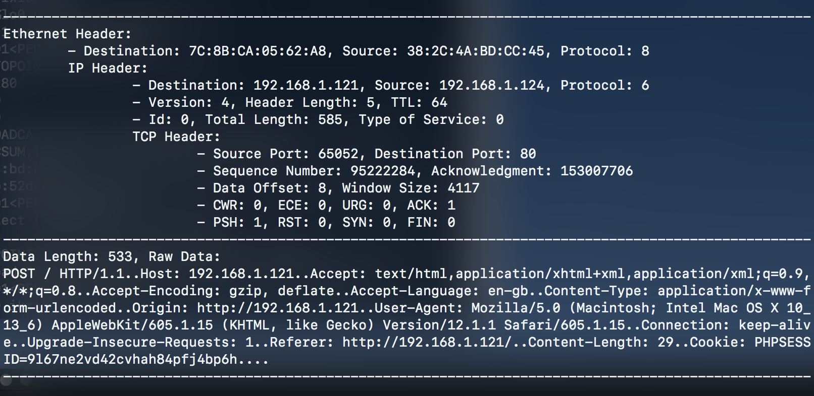
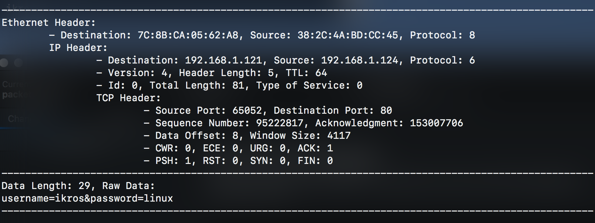

# Packet Sniffer
_**University Project – Aldo Fumagalli, Francesco Torregrossa, A.A. 19/20**_

We have created a C program that monitors and analyzes all the packets received by the computer, allowing us to show details such as the source, the recipient, the protocols used (Ethernet, IPv4, ICMP, TCP and UDP), and even the contents they carry.

Then, we installed the program on an [OrangePi](http://www.orangepi.org) device equipped with a TP-Link [TL-WN722N](https://www.tp-link.com/it/home-networking/adapter/tl-wn722n/) wireless network card.

We have also prepared a mock website using PHP, HTML and CSS (Client/Server) that simulates an audio streaming platform with login, sign up and other generic features.

In this way, by accessing and using the website via a browser, we were able to simulate sending some packages that were then analyzed by our program, running on the OrangePi. This allowed us to access sensitive data and verify the correctness of the information obtained by the program itself.

A thorough [report](relazione/Relazione.pdf) is available in Italian. You can also refer to the original [README](README-IT.md).

## Usage

To test how the sniffer works, we ran it along the web server. Since we are looking for HTTP packets containing sensitive data, we can launch the sniffer remotely (via ssh) with the following filters

```bash
gcc sniffer.c protocols/*.c protocols/*.h -o sniff
sudo ./sniff --noicmp --noudp --nounknown --noplainempty --port 80
```

By doing this, the output will only contain TCP packets (even with IP and Ethernet headers) that have non-empty content. Also, we know that the server port will be 80, so we will only take into account communications to and from that port. Once we find the IP address of the server, we can also filter the output with `--ip`.

In this example, a site administrator is logging in with his credentials. In the sniffer we can see the POST request containing the user's data, separated into two packages. Also, we can read the PHP session code that is being used by this user.

| POST request sent through a mock login form |
| :-----------------------------------------: |
|  |
|  |
